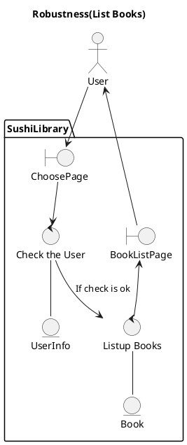
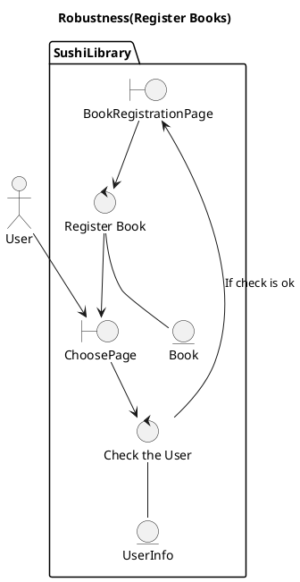

## Robustness Diagram for List Books

Basic Cource: The user access to the "ChoosePage". And "Check the User" checks if user is logginned or not. "Listup Books" read existing "Book" model. Finally "BookListPage" shows books information to the user.
Alternative Couse: If the user is not loggined SushiLibrary back to "ChoosePage".

## Robustness Diagram for Register Books

Basic Cource: The user access to the "ChoosePage". And "Check the User" checks if user is logginned or not. After that SushiLibrary shows "BookRegistrationPage" and the user input forms. Finally "Register Book" make new Book model and register and back to "ChoosePage".
Alternative Couse: If the user is not loggined SushiLibrary back to "ChoosePage".
